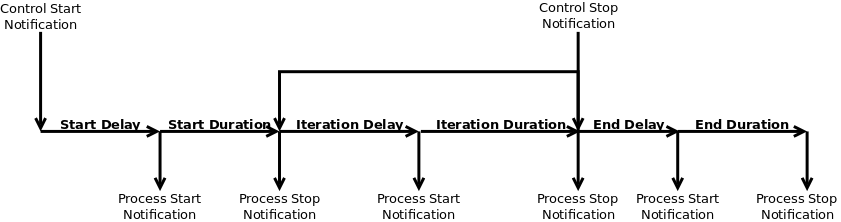
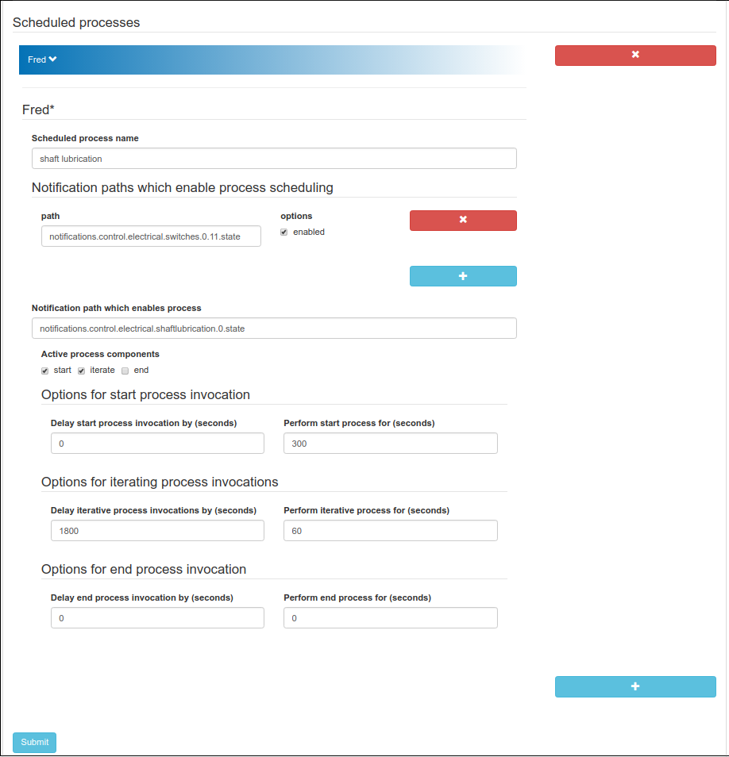

# signalk-process-scheduler

This [Signal K Node Server](https://github.com/SignalK/signalk-server-node)
plugin implements a simple process scheduler using the Signal K notification
system as its control medium.

An arbitrary number of _schedule task_ processes can be configured.
Each schedule task is modelled as a three-phase life-cycle consisting of a
start phase followed by an iterative phase and terminating with an end phase.
Any (or all) phases can be excluded from the schedule task life-cycle.

Each life-cycle phase is characterised by a user-defined _delay_ and
_duration_: delay is a period of quiescence before the controlled process is
started, whilst duration is the process execution time within the containing
phase.

A schedule task is started by the presence of one or more user-defined ALERT
notifications on the Signal K server bus and the task will continue to execute
until all defined ALERT notifications are removed or replaced by non-ALERT
variants.
When this happens signals the schedule task will enter its end phase and
subsequently stop.
## System requirements

__signalk-process-scheduler__ has no special system requirements.
## Installation

Download and install __signalk-process-scheduler__ using the _Appstore_ link
in your Signal K Node server console.

The plugin can also be downloaded from the
[project homepage](https://github.com/preeve9534/signalk-process-scheduler)
and installed using
[these instructions](https://github.com/SignalK/signalk-server-node/blob/master/SERVERPLUGINS.md).
## Usage

 __signalk-process-scheduler__ is configured through the Signal K Node server
plugin configuration interface.
Navigate to _Server_->_Plugin config_ and select the _Process scheduler_ tab.

The plugin configuration will open and presents a list of all defined schedule
tasks.
Each task is represented by a closed tab; clicking on a tab will open the
configuration page for the selected schedule task (see figure).
New schedule tasks can be added by clicking the __[+]__ button and any existing,
unwanted, schedule tasks can be deleted by clicking their adjacent __[x]__ button.

Each schedule task definition consists of the following fields.

__Process name__  
A required text value which names the process.
There is no default value.

Enter here some text which identifies the process and which will make sense when
it appears in system log file messages.

__Notification paths which enable process scheduling__
A required list of notification paths and associated options each of which will
act as a trigger for running the schedule task.
There is no default.

__path__
A notification path.

__option->enabled__
A checkbox indicating whether or not the associated path is enabled as a trigger.
Defaults to checked (true).

At least one enabled notification path is required.

__Notification path for enabling the scheduled process__
A required notification path which will be used to issue an ALERT notification
when the schedule task requires the associated process to start.
Any previously issued notification will be removed when the scheduler requires
the associated process to stop.
There is no default value.

__Active process phases__  
A checkbox menu determining which phases of the schedule task should be
implemented.
Defaults to __start__ and __iterate__.

__Options for process invocation in start phase__

__Options for process invocation in iterate phase__

__Options for process invocation in end phase__
## Use cases

__Stern gland lubrication__

_Background_

_Beatrice_ was built with an electric lubrication pump which delivers grease
directly to the propeller shaft inboard bearing and stern gland.
The pump was installed so that it operated continuously whilst the engine
ignition switch was in the RUN position and so had a 100% duty cycle.

_Problem_

Although the lubrication pump was set to its minimum delivery rate, over the
course of a day's cruise an excessive ammount of grease (around 80cc) was
being forced through the stern gland and out into the engine-room bilge.

A typical (and perfectly effective) manual lubrication system would deliver a
maximum of just one or two cubic centimetres of grease over a similar timescale.

_Requirement_

Given that the lubrication pump was configured to its minimum delivery rate,
reducing the quantity of grease arriving at the stern gland could only be achieved
by modulating the operation of the lubrication pump, so the general requirement
of "pump less grease" became: modulate the running of the lubrication pump to
reduce the lubrication duty-cycle.

Process control timers suitable for duty cycle management are readily
available - similar to a central-heating programmer their normal application
is to control a relay which is often used simply to interrupt the power supply
to a connected device.
It turned out that the cheapest commercially available process control timer
had a cost of about 200 euros and this immediately triggered thoughts of a
home-brew solution, especially since there happened to be a spare channel
available on one of the ship's engine room NMEA 2000 relay output modules.
All that was really required was some programming effort and the obvious
platform was Signal K.

Using Signal K had the additional benefit of giving access to potentially
useful system data such as temperature measurements from the ship's stern-gland
temperature sensors.

I had already developed plugins which used the Signal K notificaion system
as a medium for interfacing physical I/O and it seemed natural to follow
through on this design principle.

_Implementation_

The lubrication process scheduler is triggered by _Beatrice_'s ignition
switch which is connected to a channel on oneof the helm NMEA 2000 switch
input modules.
[signalk-threshold-notifier](https://github.com/preeve9534/signalk-threshold-notifier/)
converts this switch signal into a Signal K ALERT notification which is in turn
used to activate the lubrication process scheduler.
In this way, the scheduler runs the process when the ignition switch is in position I
(RUN) and otherwise not.
I also use _signalk-threshold-notifier_ to generate an ALERT notification when my
stern gland temperature exceeds 60C and then use this to start the lubrication
schedule too.

In the lubrication process scheduler configuration start (delay = 0s, duration = 300s)
and iterative phases (delay = 1800s, duration = 120s) are defined: the intention here
is that when the ignition switch is turned on the lubrication pump will immediately
run for five minutes and will then run for two minutes every thirty minutes.

The configuration also specifies that the scheduler should emit a 'notifications.control.shaftlubepump'
ALERT notification to signal operation of the pump.
This notification is translated into operation of the engine-room relay by
[signalk-switchbank](https://github.com/preeve9534/signalk-switchbank/)
which emits NMEA 2000 PGN127502 messages in response to changes in notification state.
## Messages

__signalk-process-scheduler__ issues the following message to the Signal K
Node server console and system logging facility.

__no processes are defined__  
The plugin has initialised but no scheduling processes have been configured.

__no processes are enabled__  
The plugin has initialised and scheduled processes have been configured,
but none of the processes can run because all enabling notification paths
are disabled.

__configuring scheduling for: _name__[__,__ _name_...]
The plugin has initialised and has configured scheduling of the _name_d
processes.

__starting scheduling of: _name__
An ALERT has been detected on one of the enabling notification paths for
schedule task _name_.
The schedule task will enter its start phase.

__stopping scheduling of: _name__
A non-ALERT has been detected on one of the enabling notification paths for
schedule task _name_.
The schedule task will enter its end phase (if any) and then stop.

__starting: _name__
Schedule task _name_ is issueing an ALERT notification for its controlled process. 

__stopping: _name__
Schedule task _name_ is cancelling any ALERT notification for its controlled process. 
